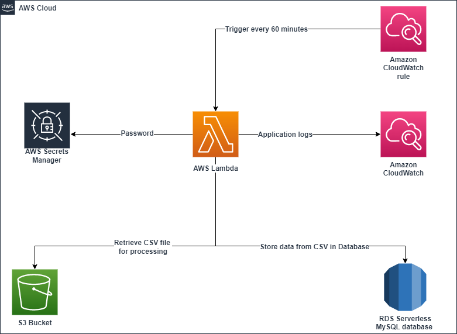

# lepaya-assessment

## Pre-requisites:
- Note this is for usage on Linux machines or Macbooks if you want to run it locally.

## Repository setup

- The Python code and related modules sit inside the src repository, I have not included the modules in the repository at this time. Usually this is not necessary and its recommended to rather install when building using the requirements.txt.
- The terraform code is placed within the deployment folder with each environment having a fodler that contains the related Terragrunt.hcl file and the main terraform.tf which then uses common modules placed with the modules folder inside the repository root directory.
- We then use the common.hcl and environment.hcl placed with the root directory to store data that we need to use as inputs into the terragrunt runs. These values are read and then stored as local values in terragrunt before being assigned to input values to terraform.
- All of the values are then defined as variables with the terragrunt directory as well as in the modules directory if they are being passsed to the module. These modules are defined with a source value which then will use the terraform files within the directory and run them with the input values defined inside the main terraform.tf file when we call the module.

### Makeflie
A Makefile is included to make running the repository locally easier.
A function to help with setting up your AWS environment before running Terraform/Terragrunt so that the S3 bucket is created for the Terraform state file and the dynamoDB instance is created for state locking. You can run ```make create_resources```. just be sure to align the values of the bucket and the dynamo DB table align with the configuration placed within the terragrunt.hcl files.

### Terraform/Terragrunt

## Running Locally:
- Ensure you run the below commands from the root directory of this project where the Makefile is placed. The first command installs python3 and pip for Python3
    - ```install_python_pip```
    - ```make prepare_lambda```
- Next you need to ensure that you have the relevant AWS credentials present either as environment variables or inside your "~/.aws/credentials" folder for the account you want to deploy to.
- Thereafter you can run the below command to deploy on either environment.
    - Staging:
        - ```terragrunt_apply_staging```
    - Production:
        - ```terragrunt_apply_production```

## GitHub actions

- Environment to be depoyed to is based on the branch used, if not "main" branch then will be deployed to staging environment.
    - The environment used is printed out in the pipeline.
- Different secret keys created for use in case of different AWS accounts for staging and production environments, these secrets should be created as follows:
    - Staging:
        - Access Key:
            - Github secret name = "AWS_ACCESS_KEY_STAGING"
        - Secret Key:
            - Github secret name = "AWS_SECRET_ACCESS_KEY_STAGING"
    - Production:
        - Access Key:
            - Github secret name = "AWS_ACCESS_KEY_PRODUCTION"
        - Secret Key:
            - Github secret name = "AWS_SECRET_ACCESS_KEY_PRODUCTION"

- Terragrunt is explictly installed due the fact that no built in github action plugin exists.
- The Lambda is created in the pipeline using the same Makefile that is used for setting up locally.
- We then deploy the terraform code using Terragrunt.

## Security
- The S3 bucket is encrypted by default by AWS but we have also ensured this is the case by explicity defining is in the creation.
- The S3 bucket is also not publicy accessible.
- The RDS database is encrypted, not publicly accessible and running on private subnets meaning it cannot be access from outside the VPC.
    - To be able to access the database from outside you need to adjust the following values.
        - modules/platform/rds.tf
            - ```publicly_accessible  = false``` to ```true```
        - Change subnets used on the database to be public subnets instead. You can change this on the database subnet group attached to the DB cluster and instance.
            - Note that the subnets used on the lambda then also need to be changed in order for the lambda to be able to connect to the database.
- The Lambda is also placed within private subnets.
- The database password is stored with AWS Secrets Manager to avoid exposing it.

# Architecture
The architecture chosen for this challenge is simple and straight forward.

- To store the CSV file we use an S3 bucket which provides secure store and at an afordable rate.
- A Lambda written in python is the used to pickup the CSV file process it and upload it to the database.
    - For logging the Lambda uses a cloudwatch log group where all application logs can we viewed. The Log level can be controlled via the environment variables field "LOG_LEVEL" within the function.
    - AWS Secrets manager is used to retrieve the password and use within the application.
- A MySQL database is is used as the DB storage, a serverless database was chosen here to keep costs down and provide scalability.
- A Cloudwatch rule was used to configure an hourly trigger to the Lambda function to ensure the data is updated on an hurly basis.
- Duplicates will be avoided due to the ID value in the CSV. This can also be extended to the emails field if desired. In the SQL script we use the "INSERT IGNORE" fucntion to ensure that duplicates do not cause the function to fail to insert new values.


